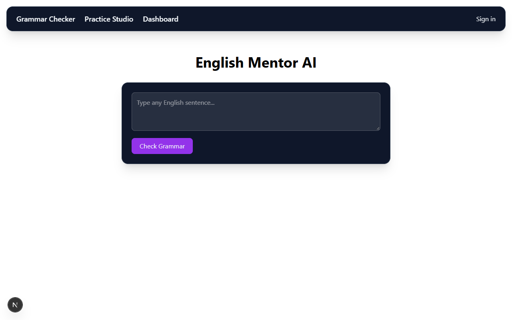
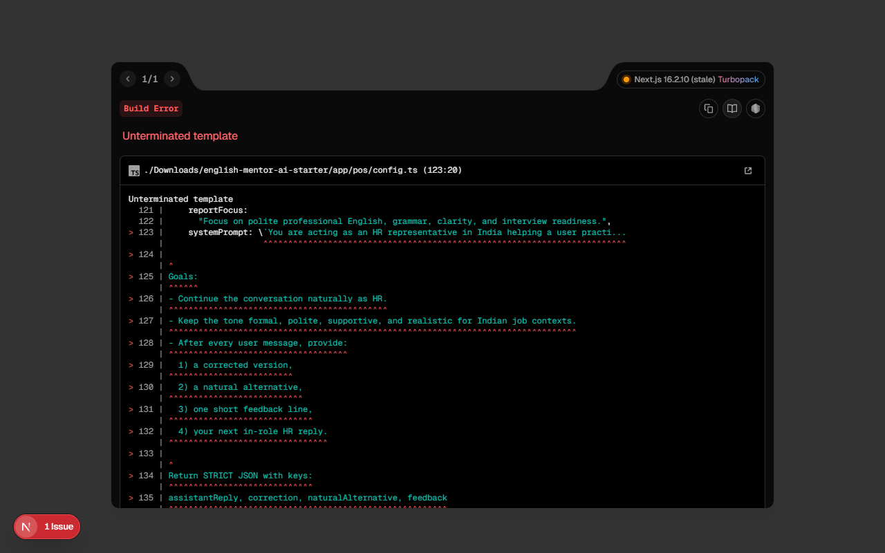
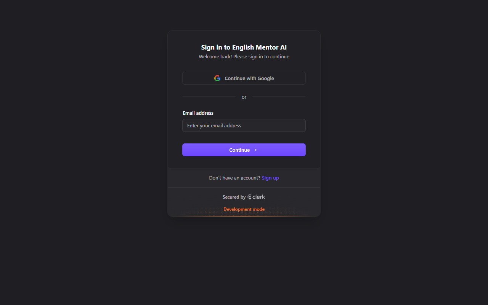

# English Mentor AI

An AI-powered English learning platform that analyzes grammar, improves writing, tracks learning progress, and provides personalized practice feedback.

## 1. Project overview

English Mentor AI is a full-stack educational tool designed to help users improve their English writing skills. Instead of just pointing out mistakes, the platform provides clear explanations, detailed grammar scoring, and tracks your improvement over time through a personalized dashboard. It is built for students, professionals, and language learners looking to perfect their everyday English.

## 2. Key features

- **AI-powered Grammar Checking:** Instant error explanation and gamified grammar score from 0–100.
- **Practice Studio:** Comprehensive suite for tone rewriting, smart replies, scenario practice, and part-of-speech tools.
- **Interactive Dashboard:** Visualizes persistent writing history, average score calculations, and daily learning streaks.
- **Secure Authentication:** User sessions and profiles powered by Clerk.

## 3. Screenshots

| Home | Practice Studio | Dashboard |
|:---:|:---:|:---:|
|  |  |  |

## 4. Live Demo

`Live Demo:` _(Deploy to Vercel and add your URL here)_

### Vercel Deployment Notes
To deploy this project:
1. Push your repository to GitHub.
2. Go to Vercel and import your repository.
3. In the Vercel dashboard, navigate to your project settings -> Environment Variables.
4. Add all variables from your `.env.example` (GEMINI_API_KEY, DATABASE_URL, NEXT_PUBLIC_CLERK_PUBLISHABLE_KEY, CLERK_SECRET_KEY).
5. Trigger a new deployment.

## 5. Tech stack

- **Frontend:** Next.js (App Router), React, Tailwind CSS, Recharts
- **Backend/API:** Next.js API Routes
- **Database:** Prisma ORM, Neon PostgreSQL
- **Authentication:** Clerk
- **AI Integration:** Google Gemini API

## 6. Architecture

User
→ Next.js UI
→ Clerk Authentication
→ Next.js API Routes
→ Gemini AI (Grammar & Tone Processing)
→ Prisma ORM
→ Neon PostgreSQL
→ Dashboard / Learning History

## 7. Database

The application uses Prisma with PostgreSQL and stores:
- **User:** Tracks user profiles, longest streaks, current streaks, and the date of their last practice (`lastPracticeAt`).
- **GrammarCheckHistory:** Logs every practice submission, the original text, corrected text, the resulting AI score (0-100), detailed feedback, and timestamps.

## 8. Local setup

To run the project locally, clone the repository and install the dependencies:

```bash
git clone https://github.com/AkshataZanjari/english-mentor-ai.git
cd english-mentor-ai
npm install
```

Create a `.env` file at the root of the project by copying `.env.example`:

```bash
cp .env.example .env
```

Fill in your actual API keys in `.env` (do not commit this file). Then initialize the database schema:

```bash
npx prisma db push
```

Start the development server:

```bash
npm run dev
```

## 9. Environment variables

You will need to configure the following variables in your `.env` file, as shown in `.env.example`:

```env
GEMINI_API_KEY=your_gemini_api_key_here
DATABASE_URL=your_postgres_connection_string_here
NEXT_PUBLIC_CLERK_PUBLISHABLE_KEY=your_clerk_publishable_key
CLERK_SECRET_KEY=your_clerk_secret_key
```

## 10. Project structure

```text
english-mentor-ai/
├── app/                  # Next.js App Router (pages, layouts, api routes)
├── components/           # Reusable React components (UI, charts, grammar tools)
├── eval/                 # Evaluation dataset and scripts for model accuracy
├── lib/                  # Utility functions and shared configuration (Prisma, Gemini)
├── prisma/               # Database schema
├── scripts/              # Development scripts and utilities
├── tests/                # Vitest unit tests for business logic
```

## 11. Testing and Evaluation

Run unit tests for logic and schemas:
```bash
npm run test
```

Run evaluation script against the sample dataset (requires GEMINI_API_KEY):
```bash
npm run eval
```

## 12. Troubleshooting

- **Voice Input Not Working:** The microphone feature relies on the Web Speech API, which is fully supported only in Google Chrome and Microsoft Edge. You must allow microphone permissions in your browser. Additionally, voice input requires the site to be served over HTTPS (or `localhost` during development).

## 13. Author

Akshata Zanjari  
B.Tech Information Technology
